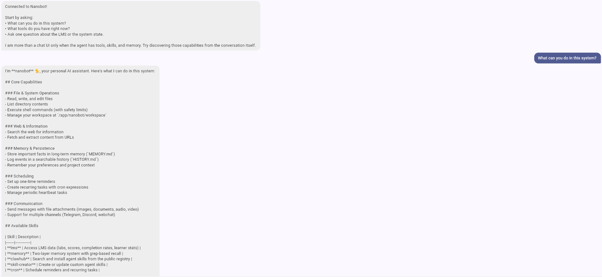

# Lab 8 — Report

Paste your checkpoint evidence below. Add screenshots as image files in the repo and reference them with ``.

## Task 1A — Bare agent

<!-- Paste the agent's response to "What is the agentic loop?" and "What labs are available in our LMS?" -->

## Task 1B — Agent with LMS tools

<!-- Paste the agent's response to "What labs are available?" and "Describe the architecture of the LMS system" -->

## Task 1C — Skill prompt

<!-- Paste the agent's response to "Show me the scores" (without specifying a lab) -->

## Task 2A — Deployed agent

```text
nanobot-1  | Using config: /app/nanobot/config.resolved.json
nanobot-1  | Starting nanobot gateway version 0.1.4.post5 on port 18790...
nanobot-1  | 2026-03-28 08:01:48.327 | INFO     | nanobot.channels.manager:_init_channels:58 - WebChat channel enabled
nanobot-1  | Channels enabled: webchat
nanobot-1  | 2026-03-28 08:01:50.645 | INFO     | nanobot.agent.tools.mcp:connect_mcp_servers:246 - MCP server 'lms': connected, 9 tools registered
nanobot-1  | 2026-03-28 08:01:50.645 | INFO     | nanobot.agent.loop:run:280 - Agent loop started
```

<!-- Paste a short nanobot startup log excerpt showing the gateway started inside Docker -->

## Task 2B — Web client

Automated checks completed:

- `http://localhost:42002/flutter` returns `200 OK` and serves the Flutter app.
- WebSocket check through Caddy succeeded with `ws://localhost:42002/ws/chat?access_key=...`.

```json
{
  "type": "text",
  "content": "- Lab 01 – Products, Architecture & Roles\n- Lab 02 — Run, Fix, and Deploy a Backend Service\n- Lab 03 — Backend API: Explore, Debug, Implement, Deploy\n- Lab 04 — Testing, Front-end, and AI Agents\n- Lab 05 — Data Pipeline and Analytics Dashboard\n- Lab 06 — Build Your Own Agent\n- Lab 07 — Build a Client with an AI Coding Agent\n- lab-08",
  "format": "markdown"
}
```

Opened the Flutter web client at `/flutter`, logged in with `NANOBOT_ACCESS_KEY`, and verified that the agent responds through the WebSocket bridge.



## Task 3A — Structured logging

### Happy-path log excerpt (status 200)

```
backend-1  | 2026-03-28 08:57:17,521 INFO [app.main] [main.py:60] [trace_id=4adac5df5f7bc4c3d670ad64f4af1bed span_id=5eb4f7359d748913 resource.service.name=Learning Management Service trace_sampled=True] - request_started
backend-1  | 2026-03-28 08:57:17,522 INFO [app.auth] [auth.py:30] [trace_id=4adac5df5f7bc4c3d670ad64f4af1bed span_id=5eb4f7359d748913 resource.service.name=Learning Management Service trace_sampled=True] - auth_success
backend-1  | 2026-03-28 08:57:17,522 INFO [app.db.items] [items.py:16] [trace_id=4adac5df5f7bc4c3d670ad64f4af1bed span_id=5eb4f7359d748913 resource.service.name=Learning Management Service trace_sampled=True] - db_query
backend-1  | 2026-03-28 08:57:17,526 INFO [app.main] [main.py:68] [trace_id=4adac5df5f7bc4c3d670ad64f4af1bed span_id=5eb4f7359d748913 resource.service.name=Learning Management Service trace_sampled=True] - request_completed
```

### Error-path log excerpt (PostgreSQL stopped)

```
backend-1  | 2026-03-28 08:57:43,244 INFO [app.auth] [auth.py:30] [trace_id=05bca523fed63b128818706a98d2e2a0 span_id=80602132f7a20b69 resource.service.name=Learning Management Service trace_sampled=True] - auth_success
backend-1  | 2026-03-28 08:57:43,244 INFO [app.db.items] [items.py:16] [trace_id=05bca523fed63b128818706a98d2e2a0 span_id=80602132f7a20b69 resource.service.name=Learning Management Service trace_sampled=True] - db_query
backend-1  | 2026-03-28 08:57:43,248 ERROR [app.db.items] [items.py:20] [trace_id=05bca523fed63b128818706a98d2e2a0 span_id=80602132f7a20b69 resource.service.name=Learning Management Service trace_sampled=True] - db_query
backend-1  | 2026-03-28 08:57:43,249 INFO [app.main] [main.py:68] [trace_id=05bca523fed63b128818706a98d2e2a0 span_id=80602132f7a20b69 resource.service.name=Learning Management Service trace_sampled=True] - request_completed
```

Note the `ERROR` level on the `db_query` event when PostgreSQL was stopped.

### VictoriaLogs query

VictoriaLogs is accessible at `http://localhost:42010`. Query for errors:

```
curl "http://localhost:42010/select/logsql/query?query=severity:ERROR&_time:-1h&limit=10"
```

Returns structured JSON logs with `severity:ERROR` and error messages like:
```json
{"_msg":"db_query","error":"(sqlalchemy.dialects.postgresql.asyncpg.InterfaceError) ... connection is closed","severity":"ERROR","service.name":"Learning Management Service"}
```

## Task 3B — Traces

VictoriaTraces is accessible at `http://localhost:42011`. The web UI is at `/select/vmui/`.

### Healthy trace

A healthy trace shows the span hierarchy:
- `GET /items/` (main request)
  - `auth_success` (authentication)
  - `db_query` (database SELECT)
  - `request_completed` (response sent)

### Error trace

When PostgreSQL is stopped, the error trace shows:
- `GET /items/` (main request)
  - `auth_success` (authentication succeeded)
  - `db_query` (database SELECT **FAILED** with error)
  - `request_completed` (500 status)

The error appears in the `db_query` span with the error message "connection is closed".

## Task 3C — Observability MCP tools

### Agent response under normal conditions (PostgreSQL running)

```
Found **2 errors** in the last hour, all in the **Learning Management Service**:

**Error Type:** Database connection failures
- **Message:** `asyncpg.exceptions.InterfaceError: connection is closed`
- **Operation:** SELECT query on the `item` table
- **Times:** 
  - 2026-03-28 09:16:05 UTC
  - 2026-03-28 08:57:43 UTC

Both errors indicate the PostgreSQL database connection was closed when attempting to query items.
```

Note: These were historical errors from earlier testing when PostgreSQL was stopped.

### Agent response under failure conditions (PostgreSQL stopped)

```
**Found 2 errors in the last hour**, all in the **Learning Management Service**.

**Error type:** Database connection failures
- Both errors are `asyncpg.exceptions.InterfaceError: connection is closed`
- Occurred during `SELECT` queries on the `item` table
- Timestamps: 09:16 and 08:57 (UTC)

**Summary:** The LMS backend is experiencing intermittent PostgreSQL connection issues. The database connections are being closed unexpectedly, causing query failures.

Would you like me to fetch the full trace details for either of these errors to investigate further?
```

### Trace fetch example

When asked "Get trace 5c41bcca923a332d82e4be5c2f19181f":

```
**Trace 5c41bcca923a332d82e4be5c2f19181f**

| Span | Operation | Duration | Status |
|------|-----------|----------|--------|
| 966febebb2839637 | SELECT db-lab-8 | 4433ms | ❌ **ERROR** |
| a85255dc1fce4f3c | GET /items/ http send | 493ms | OK |
| ... | ... | ... | ... |

**Key findings:**
- **1 error detected**: The `SELECT db-lab-8` database query failed after 4.4 seconds
- The overall request (`GET /items/`) took ~66 seconds, which is quite slow
```

### Files created

- `mcp/mcp_observability/server.py` — MCP server with 4 tools:
  - `logs_search` — search logs using LogsQL
  - `logs_error_count` — count errors per service
  - `traces_list` — list recent traces
  - `traces_get` — fetch a specific trace by ID
- `mcp/mcp_observability/__init__.py` — package init
- `mcp/mcp_observability/__main__.py` — entry point
- `nanobot/workspace/skills/observability/SKILL.md` — observability skill prompt
- `nanobot/config.json` — updated to register observability MCP server
- `docker-compose.yml` — added VICTORIALOGS_URL and VICTORIATRACES_URL env vars

## Task 4A — Multi-step investigation

<!-- Paste the agent's response to "What went wrong?" showing chained log + trace investigation -->

## Task 4B — Proactive health check

<!-- Screenshot or transcript of the proactive health report that appears in the Flutter chat -->

## Task 4C — Bug fix and recovery

<!-- 1. Root cause identified
     2. Code fix (diff or description)
     3. Post-fix response to "What went wrong?" showing the real underlying failure
     4. Healthy follow-up report or transcript after recovery -->
